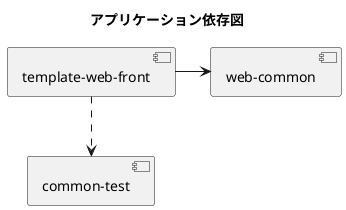

# project-template

## モジュール一覧

### primitive

javaのオブジェクトに関するユーティリティーを格納するモジュール。
業務的な部品ではない。

### precondition

事前条件をチェックするための汎用チェッカーを格納するモジュール。
汎用チェッカーを利用し業務APIや業務webアプリケーションでチェックを行う。
内部的にprimitiveモジュールを利用している。

### api-template

リソースの取得、作成、変更、削除を行う。
エンドポイントは下記の形式

```
/api/{v1.0}/{domain}/{resourceNames}/{identifier}
```

{v1.0}: バージョン
{domain}: 業務領域名 部署など 例:経理
{resourceNames}: 扱うリソース名を複数形で設定する 例:お客様 customers
{identifier}: 扱うリソース名を特定する場合に設定する 例:お客様id customers

/api/v1.0/accountingDepartment/accountTitles/aaaaaaaaaaaa

/api/v1.0/salesDepartment/reserves

この様に{identifier}が存在しない場合は全体を指す

/api/v1.0/salesDepartment/customers/aaaaaaaaaa/reserves

この様にリソースが長い場合も存在する
（営業部門で特定のお客様の予約を示すリソースなど）

api/v1.0/customer/reserves
お客様が地震の予約を取得するAPI

# apiのメソッド

GET リソースの情報の取得
POST リソースの登録
PUT リソースの変更
DELETE リソースの削除

PUTとDELETEはリソースの{identifier}が必須
GETは必要な情報に合わせて{identifier}が必須。{identifier}つけない場合、クエリーパラメーターで検索条件を付与する

### web-template

### admin-template

## アプリケーション配置図

```puml
title 非業務ユーティリティ依存関係図

component "common-precondition" as precondition
component "common-primitive" as primitive
component "common-test" as test
component "web-common" as web

precondition -> primitive
web ..> test
web -> precondition
precondition ..> test

```

