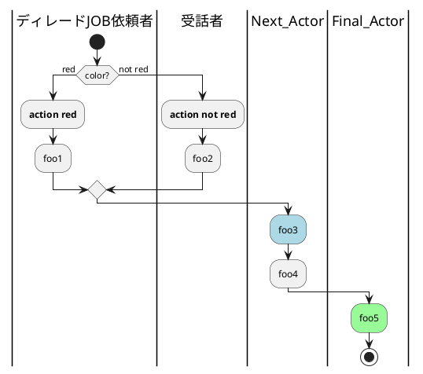

業務フローテンプレートタイトル
=====

```puml
@startuml
|ディレードJOB依頼者|
start
if (color?) is (red) then
:**action red**;
:foo1;
else (not red)
|受話者|
:**action not red**;
:foo2;
endif
|Next_Actor|
#lightblue:foo3;
:foo4;
|Final_Actor|
#palegreen:foo5;
stop
@enduml

```