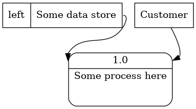

dfdテンプレート
=====

```puml
@startuml
!procedure $entity($label, $alias)
rectangle "$label" as $alias
!endprocedure

!procedure $datastore($label, $alias)
database "$label" as $alias
!endprocedure

!procedure $process($label, $alias)
storage "$label" as $alias
!endprocedure

digraph dfd{
	node[shape=record]
	store1 [label="<f0> left|<f1> Some data store"];
	proc1 [label="{<f0> 1.0|<f1> Some process here\n\n\n}" shape=Mrecord];
	enti1 [label="Customer" shape=box];
	store1:f1 -> proc1:f0;
	enti1-> proc1:f0;
}

@enduml

```

