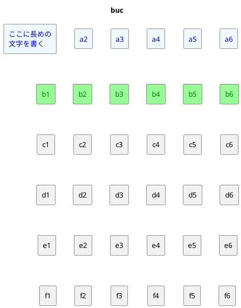

aaaaas
=====

```puml
@startuml
title: buc
rectangle "ここに長めの\n文字を書く" as a1 #aliceblue;text:blue
rectangle a2 #aliceblue;text:blue
rectangle a3 #aliceblue;text:blue
rectangle a4 #aliceblue;text:blue
rectangle a5 #aliceblue;text:blue
rectangle a6 #aliceblue;text:blue
rectangle b1 #palegreen;text:green
rectangle b2 #palegreen;text:green
rectangle b3 #palegreen;text:green
rectangle b4 #palegreen;text:green
rectangle b5 #palegreen;text:green
rectangle b6 #palegreen;text:green
rectangle c1
rectangle c2
rectangle c3
rectangle c4
rectangle c5
rectangle c6
rectangle d1
rectangle d2
rectangle d3
rectangle d4
rectangle d5
rectangle d6
rectangle e1
rectangle e2
rectangle e3
rectangle e4
rectangle e5
rectangle e6
rectangle f1
rectangle f2
rectangle f3
rectangle f4
rectangle f5
rectangle f6

    a1 -[hidden] a2
    a2 -[hidden] a3
    a3 -[hidden] a4
    a4 -[hidden] a5
    a5 -[hidden] a6

    b1 -[hidden] b2
    b2 -[hidden] b3
    b3 -[hidden] b4
    b4 -[hidden] b6
    b5 -[hidden] b6

    c1 -[hidden] c2
    c2 -[hidden] c3
    c3 -[hidden] c4
    c4 -[hidden] c5
    c5 -[hidden] c6
    
    d1 -[hidden] d2
    d2 -[hidden] d3
    d3 -[hidden] d4
    d4 -[hidden] d5
    d5 -[hidden] d6

    e1 -[hidden] e2
    e2 -[hidden] e3
    e3 -[hidden] e4
    e4 -[hidden] e5
    e5 -[hidden] e6

    f1 -[hidden] f2
    f2 -[hidden] f3
    f3 -[hidden] f4
    f4 -[hidden] f5
    f5 -[hidden] f6
    
    a1 -[hidden]- b1
    a2 -[hidden]- b2
    a3 -[hidden]- b3
    a4 -[hidden]- b4
    a5 -[hidden]- b5
    a6 -[hidden]- b6

    b1 -[hidden]- c1
    b2 -[hidden]- c2
    b3 -[hidden]- c3
    b4 -[hidden]- c4
    b5 -[hidden]- c5
    b6 -[hidden]- c6

    c1 -[hidden]- d1
    c2 -[hidden]- d2
    c3 -[hidden]- d3
    c4 -[hidden]- d4
    c5 -[hidden]- d5
    c6 -[hidden]- d6

    d1 -[hidden]- e1
    d2 -[hidden]- e2
    d3 -[hidden]- e3
    d4 -[hidden]- e4
    d5 -[hidden]- e5
    d6 -[hidden]- e6

    e1 -[hidden]- f1
    e2 -[hidden]- f2
    e3 -[hidden]- f3
    e4 -[hidden]- f4
    e5 -[hidden]- f5
    e6 -[hidden]- f6

@enduml
```