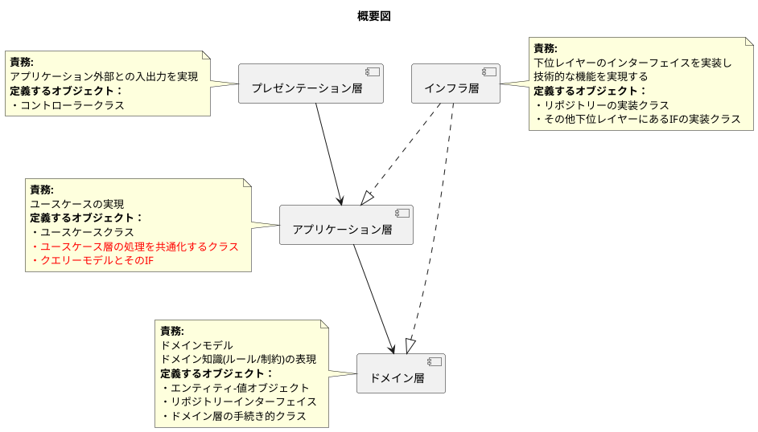

レイヤー分け
=====

```puml
@startuml
title 概要図
together {
component [プレゼンテーション層] as Comp1
component [インフラ層] as Comp2
note left of Comp1
  <b>責務:</b>
  アプリケーション外部との入出力を実現
  <b>定義するオブジェクト：</b>
  ・コントローラークラス
end note
note right of Comp2
  <b>責務:</b>
  下位レイヤーのインターフェイスを実装し
  技術的な機能を実現する
  <b>定義するオブジェクト：</b>
  ・リポジトリーの実装クラス
  ・その他下位レイヤーにあるIFの実装クラス
end note

}
component [アプリケーション層] as Comp3
component [ドメイン層] as Comp4
Comp1 -[hidden] Comp2
Comp1 --> Comp3
Comp2 ..|> Comp3 
Comp4 <|.. Comp2
Comp3 --> Comp4

note left of Comp3
  <b>責務:</b>
  ユースケースの実現
  <b>定義するオブジェクト：</b>
  ・ユースケースクラス
  <color:red>・ユースケース層の処理を共通化するクラス</color>
  <color:red>・クエリーモデルとそのIF</color>
end note
note left of Comp4
  <b>責務:</b>
  ドメインモデル
  ドメイン知識(ルール/制約)の表現
  <b>定義するオブジェクト：</b>
  ・エンティティ-値オブジェクト
  ・リポジトリーインターフェイス
  ・ドメイン層の手続き的クラス
end note
 
@enduml
```

* 黒矢印は使用を示します。白矢印はインターフェイスの実装を示します。

上から下への依存はありますが、下から上への依存はないというのが特徴。
各層の責務、何を実装する層なのを抑えます。
その層にどんなオブジェクトを書くかを考えていきます。
