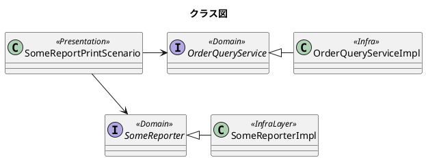

プレゼンテーション層
=====

# 責務

ユースケースの起動を責務とします。

# 例

* RestController API向け 受信しユースケースを起動し返信する。
* Controller web向け受信しユースケースを起動し返信する。
* ApplicationEventListener アプリケーションイベント発生時にユースケースを呼び出す
* Schedule 時刻や時間ごとにユースケースを起動する。

# コンバーター

リクエストをモデルで対応することによりコンバーターを作成しない

# バリデーター

モデルで対応できるものはモデルで対応する

# ユースケースシナリオ

ビジネスシナリオは複数のユースケースを呼び出す場合にコントローラーを単純化する。

```java SomeReportPrintScenario.java

@Component
class SomeReportPrintScenario {

    private final OrderQueryService orderQueryService;
    private final SomeReport someReport;

    public SomeReportPrintScenario(OrderQueryService orderQueryService, SomeReport someReport) {
        this.orderQueryService = orderQueryService;
        this.someReport = someReport;
    }

    void execute(OrderNo orderNo) {
        Orders orders = orderQueryService.selectBy(orderNoorderNo);
        if (orders.isEmpty())
            throw new DomainException("MSG_CODE", new Object[]{aaaa, key});

        for (Order order : orders)
            if (order.needPrint())
                someReport.print(order);

    }

}

```



```puml
title シーケンス
hide footbox
executor -> someReportPrintScenario :execute(key)
activate someReportPrintScenario
someReportPrintScenario -> orderQueryService :selectBy():Orders
loop for each order
  someReportPrintScenario ->  SomeReporter :print(order)
end

deactivate someReportPrintScenario

```