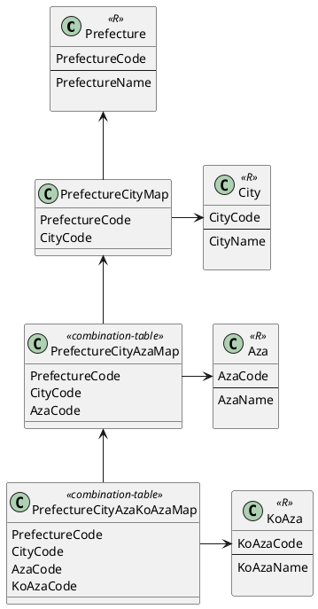
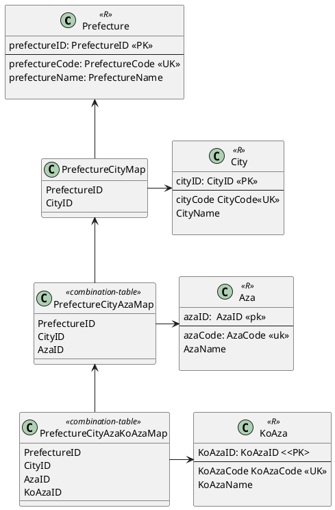

住所データを元にしたサンプル
=====

# 変換前

```puml

@startuml

class Prefecture <<R>> {
  PrefectureCode
  ---
  PrefectureName

}

class City <<R>>{
  CityCode
  ---
  CityName

}
class PrefectureCityMap {
  PrefectureCode
  CityCode
}
Prefecture <-- PrefectureCityMap
PrefectureCityMap -> City

class Aza <<R>> {
  AzaCode
  ---
  AzaName

}
class PrefectureCityAzaMap <<combination-table>> {
  PrefectureCode
  CityCode
  AzaCode
}

PrefectureCityMap <-- PrefectureCityAzaMap 
PrefectureCityAzaMap -> Aza

class KoAza <<R>> {
  KoAzaCode
  ---
  KoAzaName

}

class PrefectureCityAzaKoAzaMap <<combination-table>> {
  PrefectureCode
  CityCode
  AzaCode
  KoAzaCode
}

PrefectureCityAzaMap <-- PrefectureCityAzaKoAzaMap
PrefectureCityAzaKoAzaMap -> KoAza

@enduml


```

# 変換後

```puml

@startuml

class Prefecture <<R>> {
  prefectureID: PrefectureID <<PK>>
  ---
  prefectureCode: PrefectureCode <<UK>>
  prefectureName: PrefectureName

}

class City <<R>>{
  cityID: CityID <<PK>>
  ---
  cityCode CityCode<<UK>>
  CityName

}
class PrefectureCityMap {
  PrefectureID
  CityID
}
Prefecture <-- PrefectureCityMap
PrefectureCityMap -> City

class Aza <<R>> {
  azaID:  AzaID <<pk>>
  ---
  azaCode: AzaCode <<uk>>
  AzaName

}
class PrefectureCityAzaMap <<combination-table>> {
  PrefectureID
  CityID
  AzaID
}

PrefectureCityMap <-- PrefectureCityAzaMap 
PrefectureCityAzaMap -> Aza

class KoAza <<R>> {
  KoAzaID: KoAzaID <<PK>
  ---
  KoAzaCode KoAzaCode <<UK>>
  KoAzaName

}

class PrefectureCityAzaKoAzaMap <<combination-table>> {
  PrefectureID
  CityID
  AzaID
  KoAzaID
}

PrefectureCityAzaMap <-- PrefectureCityAzaKoAzaMap
PrefectureCityAzaKoAzaMap -> KoAza

@enduml


```
