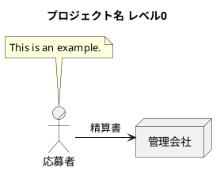
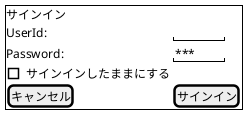

ドキュメント体系
=====
ドキュメントの体系を作成する

# システム関連図

システム関連図は、関連するアクターや外部システムとの関連を示す図です。例として採用管理システムを開発する初期フェーズでモデリングを行ったのが次の図です。

# ユースケース図

ユースケース図は、ユーザーの要求に対するシステムの振る舞いを定義する図です。

# ドメインモデル図/オブジェクト図

* オブジェクトの代表的な

プロダクト管理とユーザーストーリー