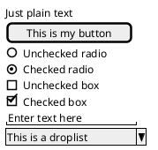

Web画面の設計
=====
パターン毎に決まっている画面遷移を修正する事により画面遷移を設計する。

モーダルによる設計/モータレスによる設計を画面遷移で意識する。

# イベント新規登録



```puml
@startuml
title UC000001 ユースケース名

class 入力画面 InputView
class 一覧画面(本日入力した物) ListView

InputView -> ListView

@enduml
```