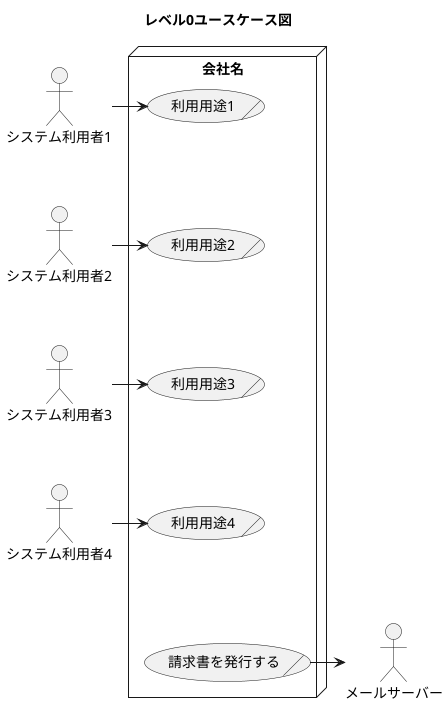
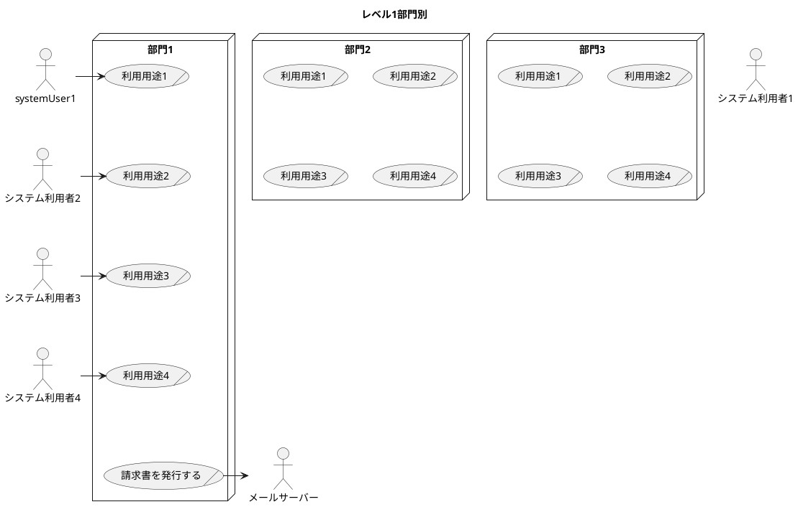
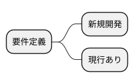

要件定義(requirement definition)
=====

# 目的

+ システムのビジネス利用用途（ビジネスユースケース）を明確化する。

* 画面を設計する際にビジネス利用用途を元に行う

* 開発を優先するビジネス利用用途を選択するために業務量を明確にする

* 運用テスト時にビジネス利用用途をシナリオとして運用ができるかを確認する

# 成果物

* ビジネスユースケース一覧
* ビジネスユースケース
* 更新業務フロー(ER) あったことを記録するために行う
* ビジネス業務ルール
* データ構造要件

ユースケースは「〇〇〇が△△△△できる。」という考え方で行う。

レベル

* 社内をブラックボックスとして社外とのやり取りを明確にする。
* 部署をブラックボックスとして、部署外とのやり取りを明確にする
* システムをブラックボックスとして、システムを利用方法を明確にする

