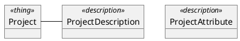

Project class diagram
=====

```puml
@startuml Book Store sample

'include ./coloruml.puml
'left_to_right()

object Project <<thing>> {
}
object ProjectAttribute <<description>> {

}

object ProjectDescription <<description>> {
}
Project - ProjectDescription

@enduml
```