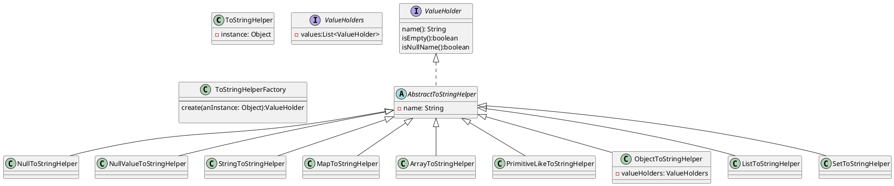

ToStringHelper class diagram.
=====

```puml
@startuml
class ToStringHelper {
- instance: Object
    
}

interface ValueHolder {
    name(): String
    isEmpty():boolean
    isNullName():boolean
}

interface ValueHolders {
    - values:List<ValueHolder>
    
}
ValueHolder <|.. AbstractToStringHelper
class ToStringHelperFactory {
    ---
    create(anInstance: Object):ValueHolder
    
}

abstract AbstractToStringHelper {
    - name: String
    
}

class NullToStringHelper {
}

class NullValueToStringHelper {
}

class StringToStringHelper {
}

class MapToStringHelper {

}
class ArrayToStringHelper {

}

class PrimitiveLikeToStringHelper {

}
class ObjectToStringHelper {
    - valueHolders: ValueHolders
}

AbstractToStringHelper <|-- NullToStringHelper
AbstractToStringHelper <|-- NullValueToStringHelper
AbstractToStringHelper <|-- PrimitiveLikeToStringHelper
AbstractToStringHelper <|-- StringToStringHelper
AbstractToStringHelper <|-- ArrayToStringHelper
AbstractToStringHelper <|-- ListToStringHelper
AbstractToStringHelper <|-- SetToStringHelper
AbstractToStringHelper <|-- MapToStringHelper
AbstractToStringHelper <|-- ObjectToStringHelper

@enduml
```