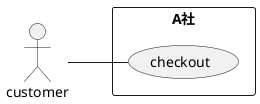
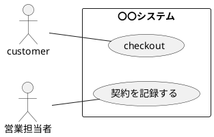

設計書にどう書くのか
=====

# 記載方式を選択する

# 文章、表形式の使い方

# フローチャート

# ER図

# UML: アクティビティ図

# UML: シーケンス図

# UML: コミュニケーションズ図

# UML: クラス図

# UML: パッケージ図

# UML: ステートマシン図

# UML: ユースケース図

レベルを意識する

# 0レベル

自社を中心に利害関係者を記載する

* ユースケースはビジネスユースケースとして作成する

# 1レベル

システムを中心に利害関係者を記載する

* ユースケースはビジネスユースケースとして作成する
* 処理順をアクティビティ図として表現する

