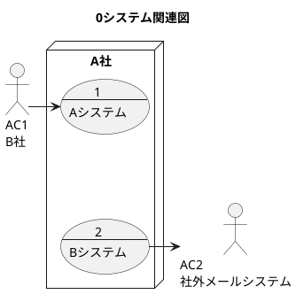
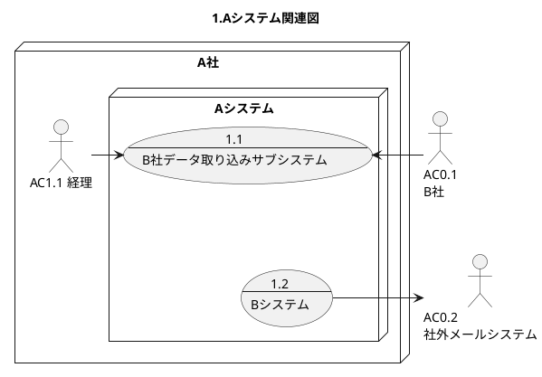
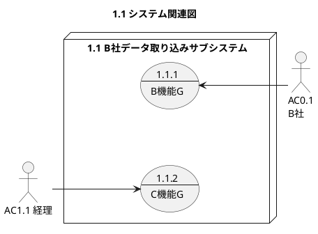

ドキュメント体系
=====
ドキュメントの体系を作成する

# システム関連図

小規模のシステム開発の場合は、レベル1でレベル2の内容を記述してレベル2は作成しない。

* レベル0 システム化対象の会社と外部ステークホルダーの関係を示す。
* レベル1 外部ステークホルダーと内部ステークホルダーとシステム化対象の会社内のシステムの関連を示す。
* レベル2 ステークホルダーと個別のシステムの関連を示す。

ドキュメントの項番はレベル0(0), レベル2(1,2), レベル3(1.1, 1.2, 2.1)

