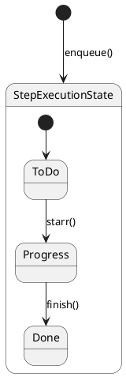
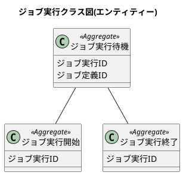
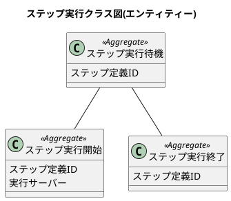
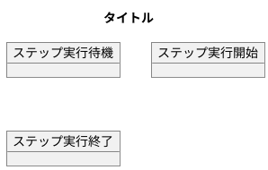
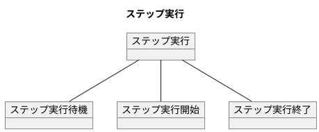
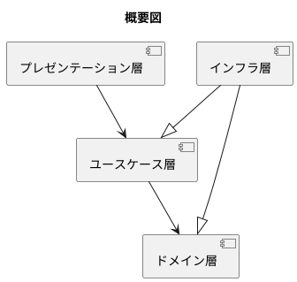
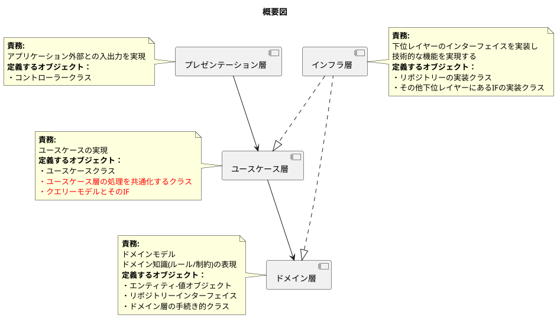
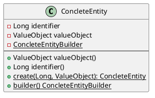
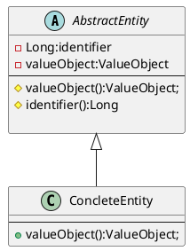

ジェネレーター使用の考慮点
=====

# 業務フロー

## ステップ実行状態



# クラス図





# モデル図

オブジェクト図でデータのイメージを作成する





## アーキテクチャ 解説付き





* 黒矢印は使用を示します。白矢印はインターフェイスの実装を示します。

上から下への依存はありますが、下から上への依存はないというのが特徴。
各層の責務、何を実装する層なのを抑えます。
その層にどんなオブジェクトを書くかを考えていきます。

### ドメイン層

ドメイン層にはドメインモデル図に書かれたクラスを書きます。そしてルール制約を書きます。

## aaa



## 生成例



## パッケージ図

```puml
  artifact [Service] as Comp1{
     package Presentation as Comp4{
       package Api {
     
       }
       package Web {
     
       }
       package Timer {
     
       }
       package Event {
     
       }
     
     }
     package UseCase {
     }
     package QueryService {
     }
     
     Comp4 --> UseCase
     Comp4 --> QueryService
  }
  artifact [infra] as Comp2{
     package QueryService as Comp5 {
     }
     package DataSource {
     }
     package Dao {
     }
     package Remoting {
     }
     package Fao {
     }
     package mail {
     }
     package report {
     }
  }
  artifact [model] as Comp3{
    package Domain{
    }
    package Types{
    }
    
  }
     Comp1 -> Comp3
     Comp3 <|.. Comp2
QueryService <|.. Comp2

```